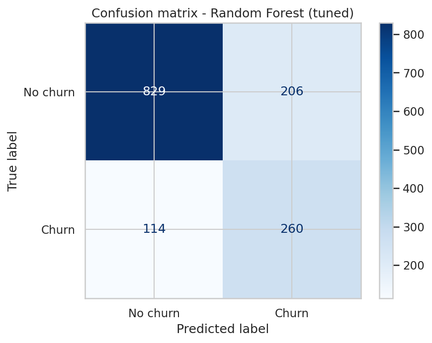
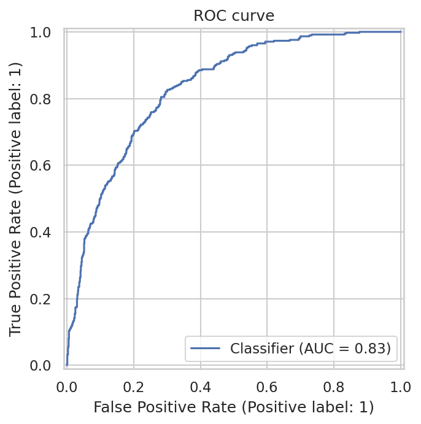
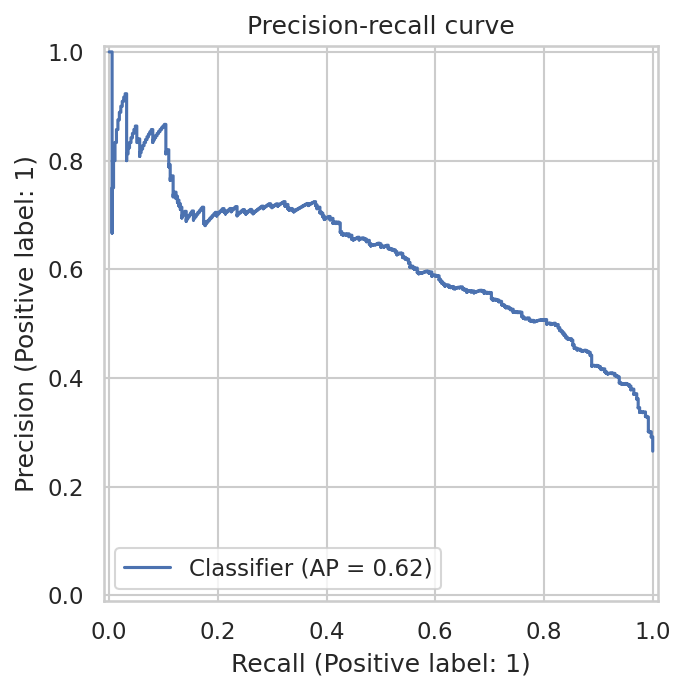
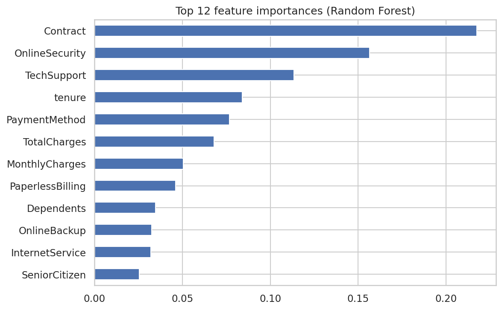

# Telco Customer Churn Prediction

## Overview

This project develops a machine learning classification system to identify
telecommunications customers who are at higher risk of churn.

The goal is not only to predict churn, but also to understand which customer
characteristics are associated with higher churn risk and how the predictions
could support customer retention strategies.

## Business Problem

Customer churn can reduce recurring revenue and increase customer acquisition
costs. A retention team can use a churn prediction model to identify customers
who may require proactive engagement.

### Business Question

> Which customers are most likely to churn, and what characteristics are
> associated with higher churn risk?

## Dataset

The project uses the IBM Telco Customer Churn dataset.

- 7,043 customers
- 21 original columns
- Binary target: Churn
- Customer demographic, service, contract and billing information

## Approach

The project follows an end-to-end machine learning workflow:

1. Data loading and validation
2. Data cleaning
3. Exploratory data analysis
4. Train/test split
5. Categorical feature encoding
6. Class imbalance handling with SMOTENC
7. Model comparison using stratified cross-validation
8. Hyperparameter tuning
9. Final evaluation on an unseen test set
10. Feature importance analysis
11. Business recommendations
12. Model serialization and prediction

## Models

The following models were evaluated:

- Dummy Classifier
- Decision Tree
- Random Forest
- XGBoost

Random Forest and XGBoost were taken forward for hyperparameter tuning.

## Evaluation

Because the dataset is imbalanced, accuracy was not used as the only
performance measure.

The main metrics were:

- Precision
- Recall
- F1-score
- ROC-AUC

### Final Model

The tuned Random Forest achieved the following results on the unseen test set:

| Metric | Score |
|---|---:|
| Accuracy | 0.773 |
| Churn Precision | 0.558 |
| Churn Recall | 0.695 |
| Churn F1 | 0.619 |
| ROC-AUC | 0.832 |

The model identified approximately 69.5% of customers who actually churned
in the test set.

## Model Evaluation

### Confusion Matrix



### ROC Curve



### Precision-Recall Curve



### Feature Importance



### Key Findings

- Month-to-month customers showed higher churn rates than customers on longer contracts.
- Customer tenure was strongly related to churn behaviour.
- Fiber customers have a churn rate of about 42%, compared with 19% for DSL customers and 7% for customers without internet service.
- Customers using electronic check have a churn rate of about 45%, compared with approximately 15%–19% for the other payment methods.
- Customers without tech support or online security have a churn rate of about 42%, compared with about 15% among customers who have these services.

## Business Recommendations

Based on the analysis:

1. Prioritize high-risk month-to-month customers for retention campaigns.
2. Focus onboarding and engagement efforts on customers with short tenure.
3. Investigate the customer segments associated with the highest churn rates.
4. Use churn probability to prioritize retention activities rather than
   treating every customer equally.

These recommendations should be combined with customer value and retention
cost before being implemented commercially.

## Example Prediction

The project includes a reusable `predict_churn()` function.

Example output:

```text
Churn probability: 0.66
Prediction: Churn
```

## Notebook

The main analysis is available in `Telco_Customer_Churn.ipynb`.

## How to Run

1. Clone this repository.
2. Install the required dependencies:

```bash
pip install -r requirements.txt
```

3. Open `Telco_Customer_Churn.ipynb` in Jupyter Notebook or JupyterLab.
4. Run the notebook cells from top to bottom.
